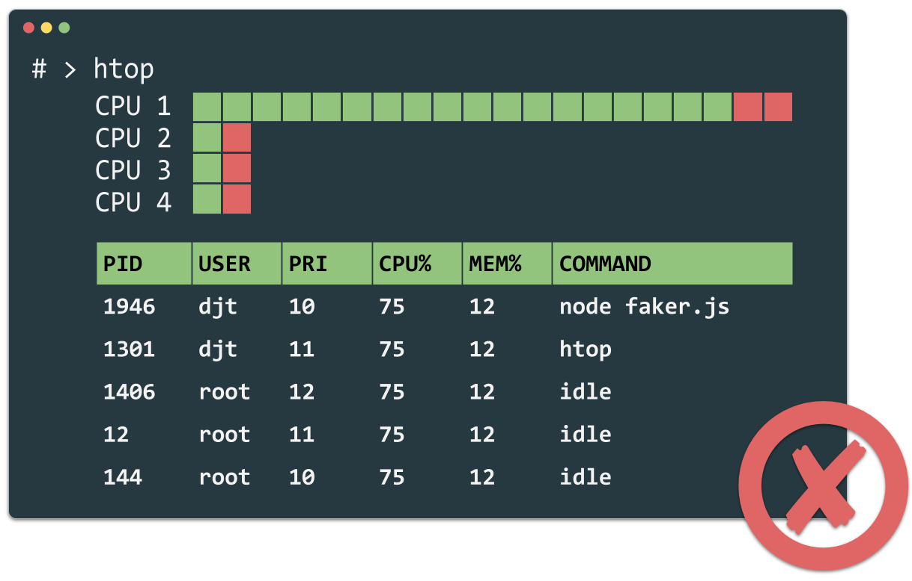
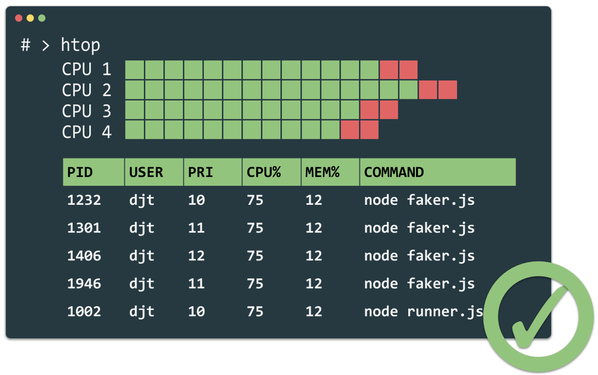

# fake data generator

**Generate fake user data with JavaScript in parallel**

> In Node.js everything runs in parallel, except your code. What this means is that all I/O code that you write in Node.js is non-blocking, while (conversely) all non-I/O code that you write in Node.js is blocking.




## Using

### Without Docker

To use this method, you need to install node >= 14 on your local system fitst.

```bash
yarn
yarn start
```

### With Docker

To use this method, you need to install Docker on your local system first.

```bash
docker run -it -v $PWD:/app -w /app node yarn
docker run -it -v $PWD:/app -w /app node yarn start
```

#### Configuration

| Name            | Description                                | Default value |
| --------------- | ------------------------------------------ | ------------- |
| TARGET_QUANTATY | Quantatiy of fake data records to generate | 500000        |
| LINES_PER_FILE  | Users per csv file.                         | 10000         |
| WORKER_TYPE     | 'auto', 'web', 'process' or 'thread'       | process       |

##### Examples

```bash
TARGET_QUANTATY=90000 LINES_PER_FILE=5000 yarn start
```

```bash
docker run -it -v $PWD:/app -w /app -e TARGET_QUANTATY=9000000 node yarn start
```

## Wanna know more about?

I wrote an article on medium about my journey in this topic.
Go ahead! [https://medium.com/p/98b990967824]

## Contributors

- [André Lademann](https://github.com/vergissberlin)
- [TheDevMinerTV](https://github.com/TheDevMinerTV)
